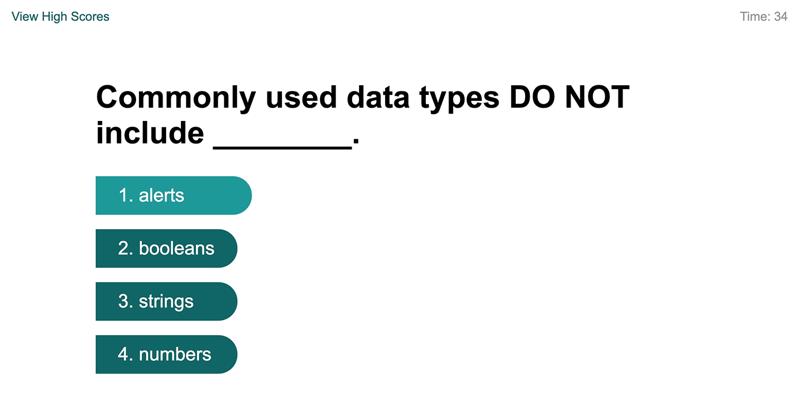

# JavaScript Quiz

## Description
1. Created a two page application. First page is the introduction and, once the start button is pressed, runs the quiz. Second page displays the high scores.
2. JavaScript file for the first page (script.js) starts the timer, displays the quiz questions, checks the user responses and subtracts 10 sec from the timer if they answer incorrectl, displays on the screen if they got the answer right or wrong, displays a form for the user to enter their initials, stores the initials and score in local storage and then sends the user to the hgh score page. Additionally, I added some other elements. Because the score is the time left at the end of the quiz, it is possible to get every question wrong and still have a final score in the 20s, so I decided to check to make sure the user had a right answer and if not give them a score of zero instead of the time left. Additionally, I have taken online quizzes where the answers are diplayed in a random order, rather than the same order every time. I added this feature as well (making sure that the "all of the above" option would always appear last). Finally, I decided that if the user had a score of 0, they would not be allowed to submit their score for the high score list, so in that case, instead of the form to fill in their initials, they would get a "Try again" button
3. Functions contained in script.js:
    1. startQuiz():
        * Runs the displayQuestion() and runTimer() functions
        * Is attached to an event listener so that it runs when the user clicks the "start quiz" button
    2. runTimer():
        * Displays the time left on the screen.
        * Subtracts 1 from the time left every second.
        * Checks if the time left is <= 0 and if it is, sets the score to zero and runs the endQuiz() function
    3. displayQuestion(): 
        * Checks to see if this is the first question. If yes, removes the "Start Quiz" button. If no, runs the markAnswer() function
        * Checks to see if the current question number is the same as the number of questions in the quiz, if yes it runs the endQuiz() function
        * loads the correct answer into the correctAnswer variable
        * Displays the question text on the screen
        * Clears the text from the paragraph on the screen
        * Creates an \<ol> element and then runs through a for loop that randomly selects an answer from the array object and if it selects "all of the above" from the array before reaching the end, has it select the previous answer instead
        * creates an \<li> tag wrapped in an \<a> tag that contains the answer and then appends it to the \<ol>
        * Removes the displayed answer from the array, so that it cannot be displayed more than once
        * Appends the \<ol> to the section \
 tag with the id "options"
        * adds 1 to the questionNumber variable
        * Adds an event listener that runs the checkAnswer() function when an answer is clicked
    4. checkAnswer(): 
        * Compares the answer clicked to the the correct answer
        * If they match, assigns the value of "Correct!" to the answerStatus variable and adds 1 to the noOfCorrectAnswers variable
        * If not a match, sets the answerStatus variable to "Incorrect!", subracts 10 form the "score" variable and updates the time left on the screen to the new score variable value.
        * runs the displayQuestion() function to display the next question.
    5. markAnswer(ans):
        * the answerStatus variable is passed to this function. 
        * checks to see if a \
 with the id answer-mark already exists in the DOM. If not, it creates the \

        * assigns the value of the answerStatus (ans) variable to the text content of the div.
    6. endQuiz():
        * stops runTimer().
        * checks to see if the user got any answers right. If not gives them a score of 0.
        * Tells the user their final score
        * If their score is higher than 0, displays a form that allows the user to enter their initials and adds an event listener that runs the saveHighScore() funtion when they click the submit button
        * If their score is zero, displays a "Try again" button
        * Adds an event listener that reloads the page if the user clicks on the "Try again" button
    7. saveHighScore():
        * adds an object containing the users initials and score to highScore array
        * Sorts the array from highest score to lowest score
        * If there are more than 10 entries in the array, removes the last one (lowest score)
        * adds the array (using the JSON stringify) to local storage under the name "scores"
        * loads the highScores.html page
4. The highScores.html file contains a heading that says "High Scores", an empty \<ol> and a \
 that holds a "Go back" and a "Clear High Scores" button. It loads the scriptHS.js JavaScript file
5. The scriptHS.js loads "scores" from local storage and loads it into an array called theScores. If their is nothing in local storage it adds an object with the value '{init:"No high scores yet. Please play the quiz.", scr:""}' to it. It then checks to see if their are any high scores. If not it displays the text "No high scores yet. Please play the quiz" and removes the "Clear High Scores" button from the DOM. Adds an event listener that checks if the go back button has been clicked and if so, loads index.html
6. Functions in the scriptHS.js file
    1. displayScores():
        * loops through theScores array with a for statement and creates an \<li> tag (inside a \
 tag that adds an alterating background colour to the row) with initials and score in it. 
        * appends the \
 and \<li> to the \<ol>
    2. clearScores();
        * removes the item "scores" from local storage
        * reloads the page
        * is run from an event listener added to the clearScoresButtonEl variable

## Screenshot

## Link to webpage
[JavaScript Quiz](https://e-p-n.github.io/jsQuiz)
